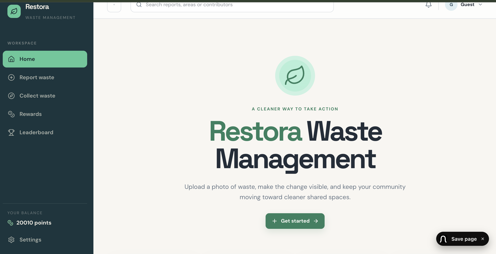
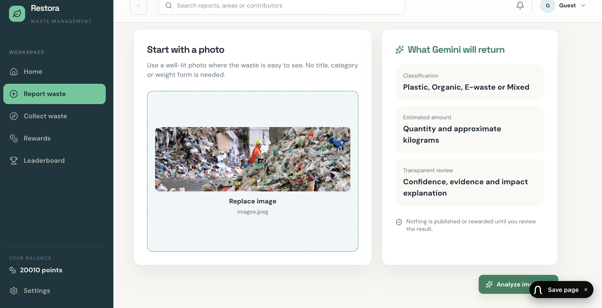
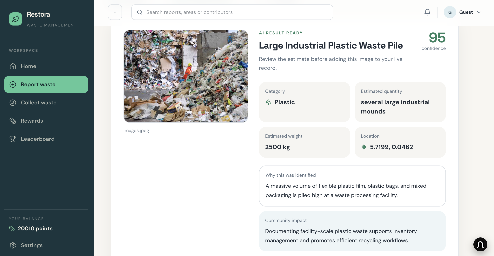
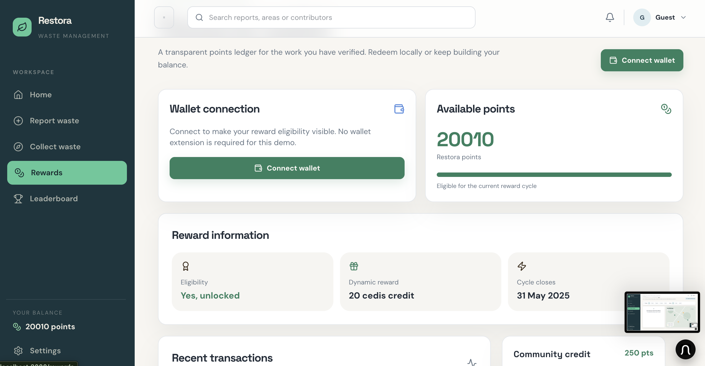

cat > README.md << 'EOF'
# Restora

**AI-verified community waste cleanup and rewards platform** — helping people reconnect with nature and take direct action on environmental health.

🔗 **Live site:** https://restora-app-1.onrender.com
 **Repo:** https://github.com/mendselvis/restora-app



## What it does

Restora lets users report litter or waste hotspots in their community, then submit a photo once the area is documented. AI-powered image verification — via the Gemini API — analyzes the photo, classifies the waste type, estimates quantity and weight, and explains its reasoning. Every report is real and accountable, not just self-reported.

Verified cleanups earn users points on a transparent rewards ledger. Restora is localized to real environmental challenges facing Ghana, including e-waste burning at Agbogbloshie and plastic pollution choking the Korle Lagoon.

## How it works

| Upload a photo | AI analyzes it | Earn rewards |
|---|---|---|
|  |  |  |

1. **Report** — upload a photo of waste at a location
2. **Verify** — Gemini analyzes the image: classification, estimated quantity and weight, confidence score, and a plain-language explanation of what it found
3. **Reward** — verified reports earn points on a transparent community ledger

## Key features

- **AI-powered verification** — Gemini-based image analysis classifies waste type, estimates quantity and weight, and explains its reasoning before anything is published
-  **Transparent rewards** — points-based ledger for verified environmental action, redeemable locally
- **Community impact map** — live visualization of cleanup activity and waste hotspots
-  **Impact dashboard** — real-time community stats on waste collected and contributors
-  **Accessible by design** — built with a voice-guided reporting flow for inclusive participation

## Tech stack

- **Frontend:** React, TypeScript, Vite, Tailwind CSS
- **Backend:** Node.js, Express
- **AI:** Google Gemini API for waste image verification
- **Database/Auth:** Supabase
- **Hosting:** Render (frontend + backend)

## Getting started

This is a pnpm monorepo. From the repo root:

```bash
pnpm install
```

### Run the frontend

```bash
cd artifacts/restora
PORT=3000 BASE_PATH=/ pnpm dev
```

### Run the backend

```bash
cd artifacts/api-server
PORT=8080 pnpm dev
```

You'll need a `.env` file in `artifacts/api-server` with:
